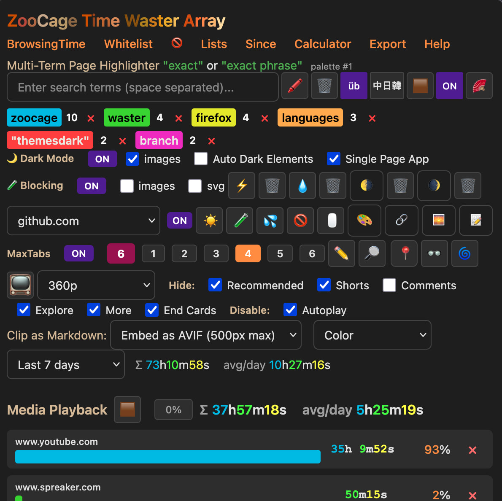

Track time spent browsing and watching media on YouTube, etc., Calculator, Unit Conversion, Dark Mode, Multi-Term Page Highlighter, Blur Images/Videos, Block Sites, Allow Right-click,Join Images, Masonry Gallery, Code Snippets, Clip to Markdown 

uses avif image which take 4x as long to encode but usually 2x to 3x smaller in file size than jpg, png, etc.  So great for saving snippets of text with images on the web.

https://addons.mozilla.org/en-US/firefox/addon/zoocage-time-waster-array/

